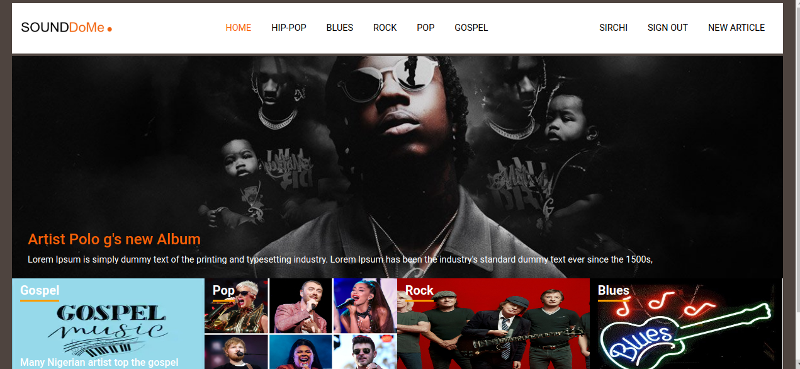
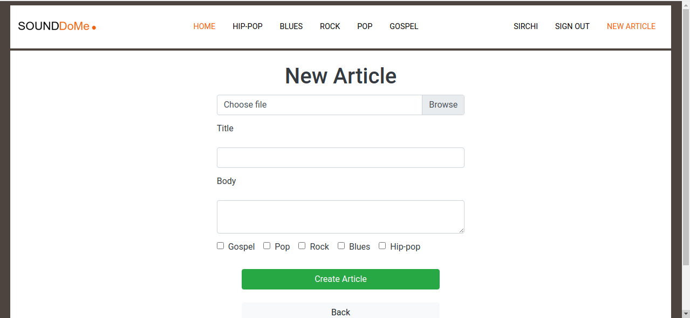

# Sound Dome, a blog website for Every Music

> This is a Ruby on Rails Capstone project in Microverse's rails curriculum, to build a Ruby on Rails application where people can write articles. Find the project description [here](https://www.notion.so/Lifestyle-articles-b82a5f10122b4cec924cd5d4a6cf7561#55d51338627b42bd95d86e2d1e58f105).

> This website is created to allow users to view, create,  and store articles about Music


### Screenshots

<p float = 'left'>
    
    
</p>

# See the Live version here - > [Live Link](https://guarded-journey-39805.herokuapp.com/)

# Built With

- Ruby v2.7.0
- Ruby on Rails v6.0.3
- HTML
- CSS
- Bootstrap
- Active-storage
- Cloudinary
- Rspec
- Capybara
- Bcrypt
- Rubocop

# Features
- Login or sign up 
- Access the available categories
- Vote for Articles
- See the highest voted article in the index page

# Prerequisites

- Ruby: 2.7.1
- Rails: 6.0
- Postgres: >=9.5

# Getting Started

### Get a local copy

`$ git clone git@github.com:Ceejayski/Sound-dome.git`

### Initial Setup

- Go to the local repo and run `bundle install`
- Updaate your yarn if its out of date with `yarn install --check-files`
- Install bootstrap with ```yarn add bootstrap jquery popper.js```

### Database Setup:
- First run `rails db:create`
- Then run `rails db:migrate`

### Start server:
- Run `rails server`

- Go to `http://localhost:3000/`


# Run tests
- Run `rails db:migrate RAILS_ENV=test`

- Run  ```bundle exec rspec ``` to run the tests.


# Author

👤 **Okoli Chijioke**

- Github: [@ceejayski](https://github.com/ceejayski)

- LinkedIn: [LinkedIn](https://www.linkedin.com/in/okoli-ceejay/)


## 🤝 Contributing

Contributions, issues and feature requests are welcome!

Feel free to check the [issues page](https://github.com/Berabjesus/Ethiopia-on-Rails/issues).

## Show your support

Give a ⭐️ if you like this project!

## Acknowledgments

- Microverse
- Heroku
- Nelson Sakwa, The designer of the [Lifestyle Articles](https://www.behance.net/gallery/14554909/liFEsTlye-Mobile-version)

## 📝 License

None
